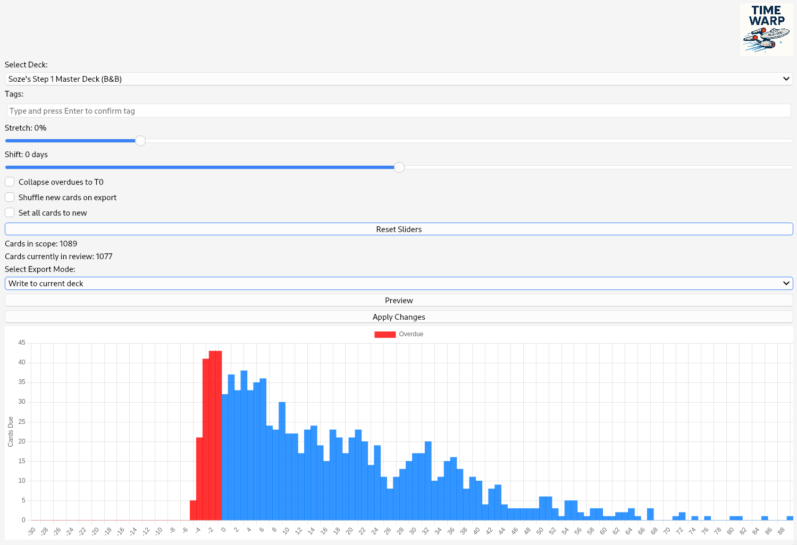

# Anki Time Warp

**Anki Time Warp** is a scheduling assistant for Anki that allows you to "time-warp" your review timelines. It’s designed for learners who want to take control of their study pace, prioritize topics, or manage their review load during unusual periods like holidays or intensive study sessions.

---

## Features

### Time Stretch & Time Shift  
- **Stretch**: Compress or expand your upcoming review intervals.  
- **Shift**: Move due dates forward or backward in time.

### Targeted Card Selection  
- Select cards from a specific deck or a combination of decks  
- Filter cards by tags to isolate thematic areas or chapters

### Filtered Deck Creation  
- Optionally create a filtered deck that temporarily holds transformed cards  
- Transformed due dates become permanent when cards are reviewed from the filtered deck

### Preview Before Applying  
- Inspect all due date changes before applying them  
- View both original and transformed due dates for transparency

### Optional Utilities  
- Shuffle transformed cards  
- Add custom tags to affected cards  
- Optionally mark cards as "new" during transformation

---

## Use Cases

- **Intensive Review Preparation**: Prioritize specific topics for upcoming exams  
- **Holiday Scheduling**: Shift due dates to avoid accumulation during breaks  
- **Catch-up Sessions**: Smooth out a backlog of overdue cards  
- **Thematic Study**: Focus on key areas like pathology or pharmacology using tag filters

---

## Screenshot

---

## Installation

1. Clone or download this repository  
2. Place the `anki_time_warp` folder in your Anki `addons21` directory  
3. Restart Anki

---

## Compatibility

- Requires Anki 2.1.55+  
- Built for Qt6 / PyQt6 (included with recent Anki versions)  
- Tested on Linux (Anki 2.1.65+), compatibility with Windows/macOS expected

---

## License

MIT License – free for personal and academic use.

---

## Contact

deep_intervention@posteo.de
