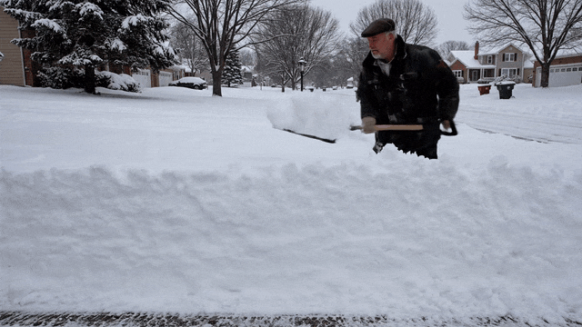
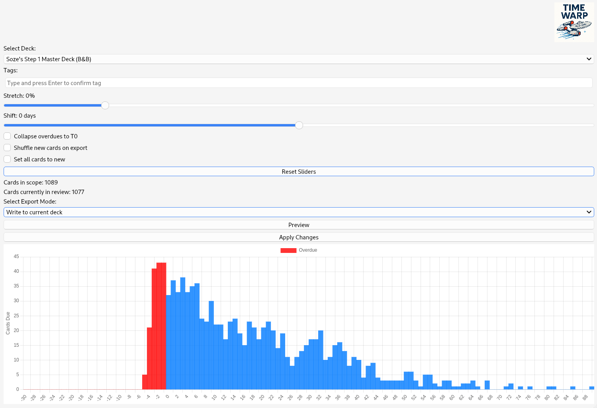

# Anki Time Warp

**Reshape your Anki review schedule — see exactly what changes before it happens.**

Same snow, better spread.

---

## What it does

Anki's scheduler optimises for retention, not for your calendar. Time Warp lets you
reshape the review load itself: spread a pile-up over more days, push everything past
a holiday, or cap how many cards a single day is allowed to hold — with a live chart
of the result before anything touches your collection.

Every transformation is **card-preserving**: no card is ever dropped or duplicated,
only moved.

---

## Features

### Shift — pause a deck, pick it up where you left off
Move the whole schedule by up to ±365 days. Every card keeps its position relative to
the others, so a deck you paused for five months comes back exactly as it was, just
five months later. This is the difference to Anki's built-in *Set Due Date*, which
scatters cards randomly and destroys their order.

Cards that are months overdue are picked up as well — the past horizon grows to fit
the oldest card in scope.

### Stretch — flatten or compress
The **Stretch** slider works on the whole review load at once rather than scaling each
card's interval individually, so the result is smooth instead of the sawtooth pattern
per-card scaling produces.

- **Positive** values blend the next 90 days toward an even daily load. Peaks are
  levelled, valleys filled; nothing moves beyond the 90-day window.
- **Negative** values compress the schedule toward today.

### Cap the daily load
**Max cards/day** puts a ceiling on any single day; the overflow spills forward into
the following days rather than being discarded.

- `-1` — off, the stretch slider controls the distribution
- `0` — auto, levels to the average over the horizon
- `>0` — a manual ceiling

### Sweep up the backlog
**Collapse overdues to T0** takes everything that is already overdue and folds it into
today instead of leaving it stranded in the past.

### Target exactly the cards you mean
Pick a single deck or all of them, then narrow further by tags. Suspended cards are
always excluded. Counters show how many cards are in scope and how many of them are
actually in review.

### See it before you commit
The chart shows the whole simulated timeline — red bars for overdue, blue for
scheduled, plus a dashed line when a daily cap is active. The preview updates as you
drag, and nothing is written until you press **Apply Changes**. Apply always
re-simulates from the current settings, so what you confirm is what gets written.

### One undo step
Due dates are rewritten in place in a single undo entry (*Edit → Undo Time Warp*).
Only the due date changes; intervals, ease and review history stay as they are.

---

## Use cases

- **Pausing a deck** — note the date you stop; when you return, shift by the number
  of days you were away and carry on as if nothing happened
- **Holiday** — shift the load past the days you will not be studying
- **Backlog recovery** — collapse the overdue pile into today and cap the daily hit
- **Sustainable pace** — flatten a lumpy month into an even one

---

## Screenshot

---

## Installation

**From AnkiWeb** — search the add-on catalogue for *Anki Time Warp*.

**Manually**

1. Download or clone this repository
2. Copy the files into a folder named `anki_time_warp` inside your Anki `addons21`
   directory
3. Restart Anki

The add-on appears under **Tools → Anki Time Warp**.

---

## Compatibility

- Anki 2.1.55 or newer
- Qt6 / PyQt6 (bundled with recent Anki builds)
- Developed and tested on Linux; Windows and macOS are expected to work

Chart.js ships with the add-on and is inlined at runtime — Time Warp makes no network
requests.

---

## Safety

Changes are written inside a single custom undo entry, so *Edit → Undo Time Warp*
reverts the whole operation. As with any add-on that edits scheduling data, take a
backup before a large transformation, and note that an undo is only available until
you sync.

Suspended and buried cards, cards in filtered decks, new cards and cards in intraday
learning are never touched.

A note on schedulers: with FSRS, moving a due date has no effect on the next interval
(FSRS measures elapsed time from the last actual review). With the SM-2 scheduler,
Anki grants an "overdue bonus" based on how late a card is answered; shifting a card
later forfeits that bonus (conservative), pulling it earlier makes the next interval
slightly larger than the elapsed time would justify. Use positive stretch with that in
mind if you are not on FSRS.

There is a standalone test suite (`python3 tests/test_core.py`) that checks card
conservation across a grid of stretch / shift / cap combinations.

---

## License

MIT — free for personal and academic use.

## Contact

deep_intervention@posteo.de
